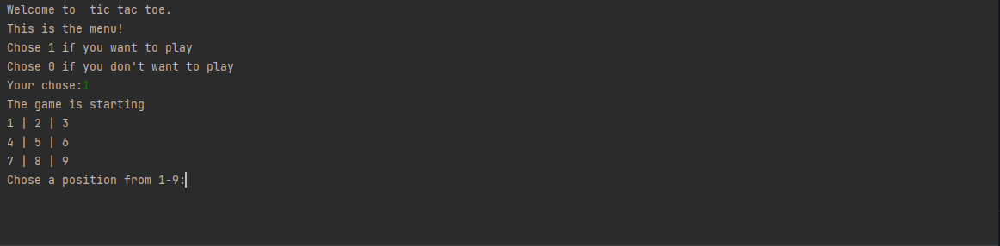
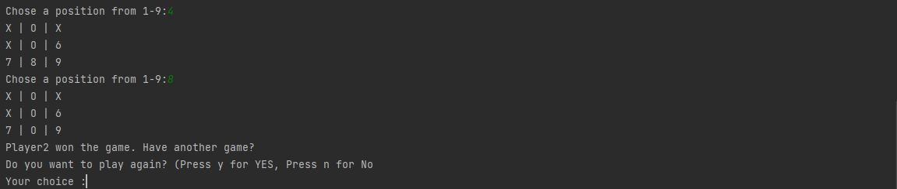

# Tic-tac-toe

Tic-tac-toe is a paper-and-pencil game for two players who take turns marking the spaces in a three-by-three grid with X or O. The player who succeeds in placing three of their marks in a horizontal, vertical, or diagonal row is the winner and they can play as many times as they want. It is a solved game, with a forced draw assuming best play from both players. The game will be launch directly from the console.

 

### *Menu interface*

### *Restart Menu*

